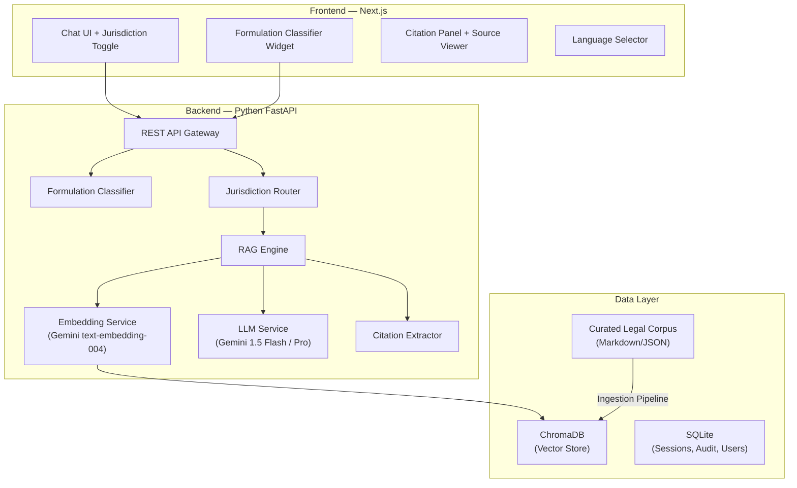
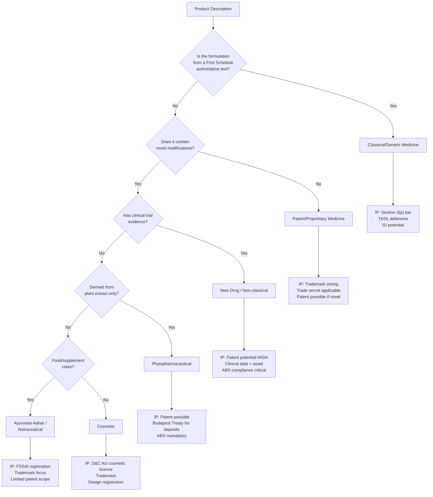

# IP-SAKTI Sahayak — Implementation Plan

A multilingual, RAG-based (source-cited) AI assistant for Intellectual Property and regulatory guidance in Ayurveda, across national and international regimes.

**Scope**: Core MVP — RAG chat with citations + jurisdiction toggle + formulation classifier  
**LLM**: Google Gemini API (free tier)  
**Deployment**: Local dev first → Docker Compose for production  

---

## Architecture Overview



---

## Tech Stack

| Layer | Technology | Rationale |
|---|---|---|
| **Frontend** | Next.js 14 (App Router) | SSR, excellent DX, React ecosystem |
| **Styling** | Vanilla CSS (design-system approach) | Full control, premium aesthetics |
| **Backend** | Python 3.11+ / FastAPI | Best RAG ecosystem (LangChain, ChromaDB) |
| **LLM** | Google Gemini API (`gemini-1.5-flash`) | Free tier, strong multilingual |
| **Embeddings** | `text-embedding-004` (Gemini) | 768-dim, high quality, free tier |
| **Vector DB** | ChromaDB (persistent) | Python-native, lightweight, great for MVP |
| **App DB** | SQLite (via SQLAlchemy) | Zero-config, sufficient for MVP |
| **Corpus Format** | Markdown + YAML frontmatter | Version-trackable, human-readable |

> [!NOTE]
> ChromaDB is chosen for the MVP because it's zero-config, Python-native, and has excellent LangChain integration. For production at scale, we can migrate to pgvector with minimal code changes.

---

## Proposed Changes

### 1. Project Scaffolding & Configuration

#### [NEW] Root project structure
```
IP-ShaktiSahayak/
├── frontend/               # Next.js application
├── backend/                # FastAPI application
│   ├── app/
│   │   ├── api/            # Route handlers
│   │   ├── core/           # Config, security, prompts
│   │   ├── models/         # Pydantic schemas
│   │   ├── services/       # RAG, LLM, classification
│   │   └── ingestion/      # Corpus loading pipeline
│   ├── corpus/             # Legal documents (Markdown)
│   │   ├── india/          # National legislation
│   │   └── international/  # Treaties, conventions
│   ├── chroma_db/          # Persistent vector store
│   └── requirements.txt
├── docker-compose.yml
├── .env.example
└── README.md
```

---

### 2. Backend — FastAPI + RAG Engine

#### [NEW] `backend/app/core/config.py`
- Environment configuration (Gemini API key, ChromaDB path, CORS origins)
- Model selection constants

#### [NEW] `backend/app/core/prompts.py`
- System prompts for the RAG chain with:
  - Mandatory "information, not legal advice" disclaimer
  - Instruction to cite specific statute/rule/treaty article
  - Jurisdiction-aware response formatting
  - Confidence indicator instructions
  - Safe abstention on uncertain queries

#### [NEW] `backend/app/services/rag_service.py`
- **Core RAG pipeline**:
  1. Receives query + jurisdiction (India / International)
  2. Generates query embedding via Gemini
  3. Retrieves top-k chunks from ChromaDB (filtered by jurisdiction metadata)
  4. Constructs augmented prompt with retrieved context
  5. Calls Gemini LLM with augmented prompt
  6. Extracts and structures citations from response
  7. Returns answer + citations + confidence score

#### [NEW] `backend/app/services/embedding_service.py`
- Wrapper around Gemini `text-embedding-004`
- Batch embedding for corpus ingestion
- Single-query embedding for retrieval

#### [NEW] `backend/app/services/llm_service.py`
- Gemini API client wrapper
- Token counting, rate limiting
- Streaming response support

#### [NEW] `backend/app/services/classifier_service.py`
- **Formulation Classification Flow**:
  1. Takes product description as input
  2. Asks minimum clarifying questions (LLM-guided)
  3. Classifies into categories:
     - Classical/Generic medicine (First Schedule text)
     - Patent/Proprietary medicine
     - New/Non-classical drug
     - Phytopharmaceutical
     - Ayurveda-Aahar / Nutraceutical
     - Cosmetic
  4. Returns classification + IP implications + regulatory posture
  5. Maps to relevant statutes (Section 3(p), TKDL, D&C Act, etc.)

#### [NEW] `backend/app/services/citation_service.py`
- Extracts statute/rule/treaty references from LLM responses
- Validates citations against known corpus metadata
- Generates linkable references to source documents
- Assigns confidence indicator (High / Medium / Low)

#### [NEW] `backend/app/api/routes/chat.py`
- `POST /api/chat` — Main RAG query endpoint
  - Request: `{ query, jurisdiction, session_id, language? }`
  - Response: `{ answer, citations[], confidence, disclaimer, sources[] }`
- `POST /api/chat/stream` — Streaming variant (SSE)

#### [NEW] `backend/app/api/routes/classify.py`
- `POST /api/classify` — Start formulation classification
- `POST /api/classify/followup` — Answer clarifying question

#### [NEW] `backend/app/api/routes/sources.py`
- `GET /api/sources` — List all corpus documents
- `GET /api/sources/{id}` — Get full source document text
- `GET /api/sources/search` — Search corpus by keyword

#### [NEW] `backend/app/models/schemas.py`
- Pydantic models: `ChatRequest`, `ChatResponse`, `Citation`, `ClassificationResult`, `Source`, etc.

#### [NEW] `backend/app/ingestion/ingest.py`
- **Corpus Ingestion Pipeline**:
  1. Reads Markdown files from `corpus/` directory
  2. Extracts YAML frontmatter (title, jurisdiction, statute, date, category)
  3. Chunks documents using recursive text splitter (512 tokens, 50 overlap)
  4. Generates embeddings via Gemini
  5. Stores in ChromaDB with metadata (jurisdiction, statute_name, section, category)
  6. Tracks corpus version for updates

---

### 3. Curated Legal Corpus

> [!IMPORTANT]
> The corpus is the backbone of citation quality. Each document is a Markdown file with structured YAML frontmatter for filtering and citation.

#### [NEW] `backend/corpus/india/` — National Legislation
Representative files (we will seed ~15-20 key documents for MVP):

| Document | File |
|---|---|
| Patents Act 1970 (key sections: 2, 3(d), 3(p), 25, 64) | `patents_act_1970.md` |
| Patents Rules 2024 | `patents_rules_2024.md` |
| Biological Diversity Act 2002 (as amended 2023) | `biodiversity_act_2002.md` |
| Biological Diversity Rules 2024 | `biodiversity_rules_2024.md` |
| Drugs & Cosmetics Act 1940 (AYUSH provisions) | `drugs_cosmetics_act.md` |
| GI of Goods Act 1999 | `gi_act_1999.md` |
| Trade Marks Act 1999 | `trademarks_act_1999.md` |
| Copyright Act 1957 | `copyright_act_1957.md` |
| Designs Act 2000 | `designs_act_2000.md` |
| Plant Variety Protection Act 2001 | `plant_variety_act_2001.md` |
| FSSAI Ayurveda-Aahar Regulations | `fssai_ayurveda_aahar.md` |
| D&MR (Objectionable Advertisements) Act | `dmr_act.md` |
| TKDL Overview & Usage | `tkdl_overview.md` |
| DPDP Act 2023 (privacy framework) | `dpdp_act_2023.md` |

#### [NEW] `backend/corpus/international/` — International Treaties
| Document | File |
|---|---|
| TRIPS Agreement (relevant articles) | `trips_agreement.md` |
| CBD — Convention on Biological Diversity | `cbd_convention.md` |
| Nagoya Protocol | `nagoya_protocol.md` |
| WIPO GRATK Treaty 2024 | `wipo_gratk_treaty_2024.md` |
| PCT — Patent Cooperation Treaty | `pct_treaty.md` |
| Madrid System (Trademarks) | `madrid_system.md` |
| Hague System (Designs) | `hague_system.md` |
| Budapest Treaty (Microorganism Deposits) | `budapest_treaty.md` |

#### Document Format
```markdown
---
title: "Patents Act, 1970"
jurisdiction: "india"
category: "patent"
statute_type: "act"
last_amended: "2024"
official_source: "https://indiacode.nic.in/..."
sections_covered: ["2", "3(d)", "3(p)", "25", "48", "64"]
version: "1.0"
---

# Patents Act, 1970

## Section 3 — What are not inventions
...
```

---

### 4. Frontend — Next.js Application

#### [NEW] `frontend/src/app/page.js`
- Landing page with hero section
- Quick-start buttons: "Ask an IP Question" / "Classify My Formulation"

#### [NEW] `frontend/src/app/chat/page.js`
- **Main Chat Interface**:
  - Jurisdiction toggle (India 🇮🇳 / International 🌍) — prominently visible, always accessible
  - Chat input with rich textarea
  - Response cards with:
    - Answer text (markdown rendered)
    - Citation sidebar (collapsible)
    - Confidence indicator (color-coded badge)
    - Standing disclaimer banner
  - "Escalate to IP Facilitator" button
  - Source preview drawer (shows original document text)

#### [NEW] `frontend/src/app/classify/page.js`
- **Formulation Classifier**:
  - Step-by-step wizard UI
  - Product description input
  - Dynamic clarifying questions from LLM
  - Result card showing: category, IP implications, regulatory requirements, relevant statutes

#### [NEW] `frontend/src/components/`
- `ChatMessage.js` — Individual message bubble with citation links
- `CitationPanel.js` — Collapsible sidebar showing source documents
- `JurisdictionToggle.js` — India/International switch
- `ConfidenceBadge.js` — High/Medium/Low indicator
- `DisclaimerBanner.js` — Persistent legal disclaimer
- `SourceViewer.js` — Full document viewer drawer
- `ClassifierWizard.js` — Multi-step classification flow
- `LanguageSelector.js` — Language picker (English default, Hindi, others future)
- `Header.js` / `Footer.js` — Navigation

#### [NEW] `frontend/src/styles/`
- `globals.css` — Design system tokens, typography, base styles
- `chat.css` — Chat interface styles
- `classify.css` — Classifier styles
- `components.css` — Shared component styles

#### Design System
| Token | Value | Usage |
|---|---|---|
| `--color-primary` | `#D4A843` (Golden/Saffron) | Primary actions, Ayurveda identity |
| `--color-secondary` | `#2D5F3E` (Deep Green) | Secondary, nature/herb connection |
| `--color-bg-dark` | `#0F1419` | Dark mode background |
| `--color-surface` | `#1A2332` | Card surfaces |
| `--color-india` | `#FF9933` | India jurisdiction badge |
| `--color-intl` | `#3B82F6` | International jurisdiction badge |
| `--font-primary` | `'Inter', sans-serif` | Body text |
| `--font-display` | `'Outfit', sans-serif` | Headings |

> [!TIP]
> The design uses a dark-mode-first, glassmorphism-infused aesthetic with saffron/green accents — reflecting Ayurveda's identity while feeling premium and modern.

---

### 5. Docker & DevOps

#### [NEW] `docker-compose.yml`
- `frontend` service (Node 20, port 3000)
- `backend` service (Python 3.11, port 8000)
- Shared `.env` for API keys

#### [NEW] `backend/Dockerfile`
#### [NEW] `frontend/Dockerfile`
#### [NEW] `.env.example`

---

## Key Design Decisions

### 1. Jurisdiction Separation
Queries are **always** scoped to a jurisdiction. ChromaDB collections are filtered by `jurisdiction: "india" | "international"` metadata. The LLM prompt explicitly instructs: *"Answer ONLY from {jurisdiction} sources. Do not conflate national and international regimes."*

### 2. Citation Grounding
Every RAG response follows a strict format:
```
[Answer text citing §Section X of Act Y]

📜 Sources:
1. Patents Act, 1970 — Section 3(p) [Confidence: HIGH]
2. TKDL Classification — Category: K07 [Confidence: MEDIUM]

⚖️ This is information, not legal advice. Consult a qualified IP attorney.
```

### 3. Safe Abstention
The system prompt instructs the LLM to respond with *"I don't have enough information to answer this accurately. I recommend consulting an IP professional."* when retrieved context is insufficient (low similarity scores < 0.65).

### 4. Formulation Classifier Decision Tree


---

## Open Questions

> [!IMPORTANT]
> **1. Gemini API Key**: Do you already have a Google AI Studio API key, or should I include setup instructions for obtaining one?

> [!IMPORTANT]
> **2. Corpus Depth**: For the MVP, I'll seed ~25 key legal documents with the most critical sections. The full corpus can be expanded incrementally. Is that acceptable, or do you need more coverage from day one?

> [!NOTE]
> **3. Multilingual Scope for MVP**: The problem statement mentions Bhashini integration. For the Core MVP, I propose English-only with the UI wired for language selection (Hindi labels, ready for Bhashini API integration in the next phase). Acceptable?

---

## Verification Plan

### Automated Tests
```bash
# Backend unit tests
cd backend && pytest tests/ -v

# Test RAG pipeline with sample queries
pytest tests/test_rag.py -v

# Test formulation classifier
pytest tests/test_classifier.py -v

# Frontend build verification
cd frontend && npm run build
```

### Manual Verification
1. **RAG Accuracy**: Ask 5 sample queries across jurisdiction types, verify citations match source documents
2. **Jurisdiction Toggle**: Verify same query produces different, jurisdiction-correct answers
3. **Formulation Classifier**: Walk through 3 product scenarios, verify correct classification
4. **Citation Quality**: Every answer must have ≥1 traceable citation
5. **Safe Abstention**: Ask an out-of-scope question, verify graceful refusal
6. **UI/UX**: Verify responsive design, dark mode, glassmorphism effects, smooth animations

### Sample Test Queries
| Query | Jurisdiction | Expected Behavior |
|---|---|---|
| "Can I patent a classical Ayurvedic formulation?" | India | Cite Section 3(p), explain TKDL defense |
| "What is the Nagoya Protocol?" | International | Cite Nagoya Protocol articles, explain ABS |
| "How do I register a GI for turmeric from Erode?" | India | Cite GI Act 1999, explain registration process |
| "What are TRIPS flexibilities for traditional medicine?" | International | Cite TRIPS Art. 27, 29, explain TK provisions |
| "Classify: A new extract from Ashwagandha with clinical trials" | N/A | Classify as New Drug, cite patent potential |

---

## Phased Roadmap

| Phase | Scope | Status |
|---|---|---|
| **Phase 1 (Current)** | RAG chat + citations + jurisdiction toggle + formulation classifier | 🎯 This build |
| **Phase 2** | ABS compliance helper + TKDL/prior-art pointer + confidence scoring | Next |
| **Phase 3** | Bhashini multilingual + Hindi/regional language support | Future |
| **Phase 4** | Knowledge graph (Neo4j) + agentic multi-source orchestration | Future |
| **Phase 5** | Paid-source connectors + voice interface + DPDP compliance | Future |
